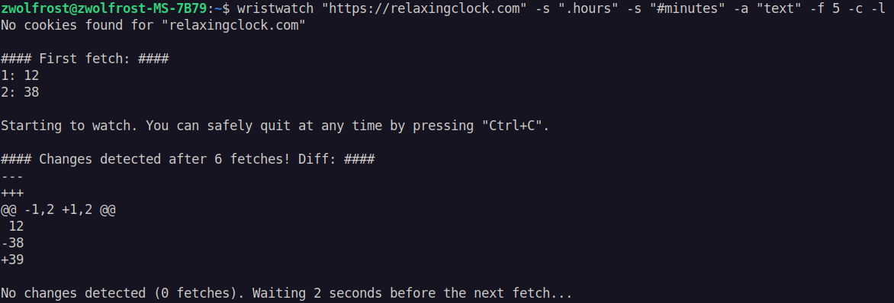

# wristwatch
Yet another Python watcher for website updates.

Supports:
- Selecting elements to watch with CSS selectors.
- Importing Cookies from any browser (to scrape webpages that require authentication).
- Other stuff...

You can safely quit watching at any time by pressing `Ctrl+C`.

&nbsp;
## Requirements
- [Python 3](https://www.python.org/downloads/) with pip.

## Installation
```bash
pip install -U wristwatch
```

&nbsp;
## Arguments
| Command    | Shorthand | Example                  | Description
|:-:         |:-:        | :-:                      |:-
|            |           | `https://example.com/`   | The URL of the webpage to scrape.
| --browser  | -b        | `-b chrome`              | Name of the browser to get cookies from (default: any).
| --frequency| -f        | `-f 60`                  | Frequency of fetches in seconds (default: 60).
| --selector | -s        | `-s #minutes -s #hours`  | CSS selector of element(s) to scrape. Can be used multiple times.
| --email    | -e        | `-e example@gmail.com`   | Email address to self-send the changes to.
| --password | -p        | `-p aaaa bbbb cccc dddd` | Email "app" password. Here's a guide on how to generate one: https://support.google.com/accounts/answer/185833
| --quiet    | -q        | `-q`                     | Decrease output verbosity.
| --loop     | -l        | `-l`                     | Keep watching for changes even after the first one.
| --output   | -o        | `-o output.txt`          | Save the last fetch to a file.
| --input    | -i        | `-i input.txt`           | Load the first fetch from a file.
| --version  | -v        | `-v`                     | Show the program's version.

&nbsp;
## Examples
```bash
wristwatch "https://relaxingclock.com" -s "#minutes" -f 5
```

&nbsp;
## Screenshots

